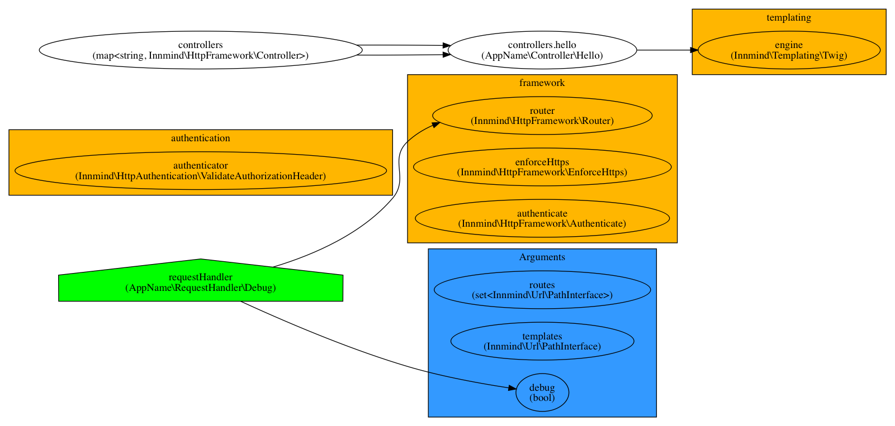

# Http app skeleton

| `master` | `develop` |
|----------|-----------|
| [](https://scrutinizer-ci.com/g/Innmind/HttpAppSkeleton/?branch=master) | [](https://scrutinizer-ci.com/g/Innmind/HttpAppSkeleton/?branch=develop) |
| [](https://scrutinizer-ci.com/g/Innmind/HttpAppSkeleton/?branch=master) | [](https://scrutinizer-ci.com/g/Innmind/HttpAppSkeleton/?branch=develop) |
| [](https://scrutinizer-ci.com/g/Innmind/HttpAppSkeleton/build-status/master) | [](https://scrutinizer-ci.com/g/Innmind/HttpAppSkeleton/build-status/develop) |

This is an example to build a http app using [`innmind/http-framework`](https://github.com/Innmind/HttpFramework).

## Why ?

Over the past few years I've grown to understand that there's mostly to kind of objects: objects holding data and objects making flow the data through the system. Essentially it's what we've learned in school with the math `y = f(x)` where `x` and `y` are data objects and `f` in our object making flow the data. We've also learned in math that we can compose _functions_ like this `y = f(g(x))`. In essence this is what functional programming is about (at least to what I've understood of it).

The framework is built around these principles where you build the app by stacking the objects that make the data flow through the app. The result is a code that makes things explicit as when debugging you can see every layer the data has gone through to reach the point where it's at; no hidden logic behind event listeners.

In order to make the data flow safely it must be typed (another aspect of functional programming), meaning primitives are wrapped in objects to express what they mean and their behaviour. That's why the framework use [`innmind/http`](https://github.com/Innmind/Http) instead of a `psr-7` implementation as this psr uses primitives to represent data.

The expected result is to have an application built by composing smaller components together in order to reveal intent. And since each component is independent it can be tested in isolation increased overall quality.

## Installation

```sh
composer create-project innmind/http-app-skeleton
```

## Structure

```
/config
  |- .env # define your app variables here
  |- container.yml # container definition where to bind every component of the app (see innmind/compose for further documentation)
  |- routes.yml # every route pattern of your application, path defined in /public/index.php
/public
  |- index.php # entrypoint of the app
/src # store the code of your app here
  |- Controller # the framework doesn't impose a folder structure
    |- Hello.php # example controller
  |- RequestHandler
    |- Debug.php # simple handler to help debug in cases of errors in your code
/templates # store your templates here, path defined in /public/index.php
  |- hello.html.twig # example template used by the Hello controller
/tests # contains all your phpunit tests (like usual)
```

## Web server

For development purpose simply use the built-in php server:

```sh
cd public && php -S localhost:8000
```

## Run tests

```sh
composer test
```

## App graph visualization

It's sometimes useful to visualize the dependency graph of your code to help grasp the full structure of the app. To do so run the following command:

```sh
vendor/bin/compose watch config/container.yml graph.svg
```

**Note**: you can also output the grap as an image by simply replacing `graph.svg` by `graph.png` in the command above.

This command will output the dependency graph of your app alone, it won't show the inner structure of the libraries you used (the ones imported under the `dependencies` key in the `container.yml`).

Here is the current structure of the app:


